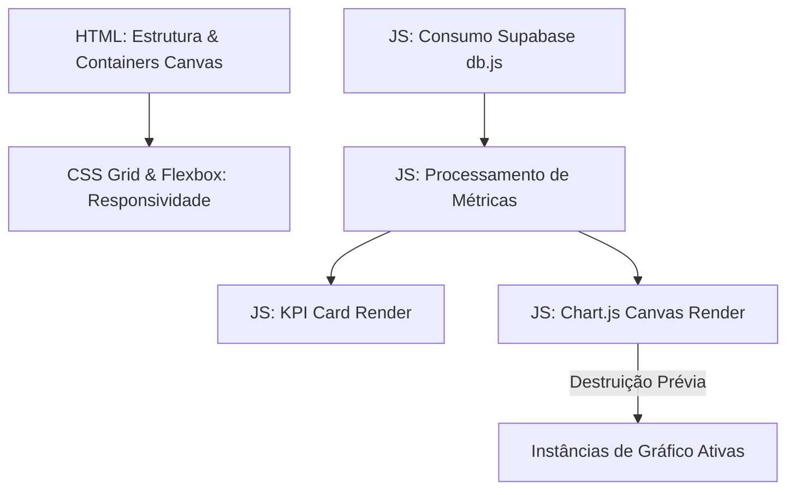

# Análise Arquitetural e Guia de Adaptação: Painel Gerencial para Gestor de Orçamento

Este documento fornece uma análise profunda do código do **Painel Gerencial SPUnet** (composto por [painel-gerencial.html](file:///c:/Users/luizn/Documents/1-PROGRAMAS/Foco-10/painel-gerencial.html), [painel-gerencial.js](file:///c:/Users/luizn/Documents/1-PROGRAMAS/Foco-10/painel-gerencial.js) e [painel-gerencial.css](file:///c:/Users/luizn/Documents/1-PROGRAMAS/Foco-10/painel-gerencial.css)), estruturado como um guia prático de migração para o projeto **gestorDeOrcamento** (visualização de entradas e saídas de recursos).

---

## 1. Visão Geral da Arquitetura do Painel

O painel gerencial é construído sob uma arquitetura limpa de 3 camadas (*frontend-only* com integração reativa a banco de dados):



### Componentes Principais
1.  **Estrutura de Visualização (HTML):** Define a barra de navegação superior, a grade de cartões de KPI (`.kpi-grid`) e a grade de renderização de gráficos (`.charts-grid`).
2.  **Estilização Premium (CSS):** Baseado na fonte *Inter*, com layouts em CSS Grid responsivos de 12 colunas, bordas arredondadas suaves, sombras sutis (`box-shadow`) e paleta baseada em tons ardósia (`slate/blue/amber/green`).
3.  **Lógica Dinâmica (JS):**
    *   Filtra permissões de acesso (Scaffold).
    *   Faz a **mesclagem em tempo de execução** de dados de duas tabelas distintas (`foco_drafts` e `foco_final`), utilizando uma estrutura `Map` para evitar duplicação (usando o `id` como chave).
    *   Processa as métricas e SLAs de tempo.
    *   Renderiza gráficos interativos via **Chart.js** (garantindo que gráficos anteriores sejam destruídos antes de novas renderizações, evitando fantasmas visuais).

---

## 2. Análise Detalhada do Código Fonte

### A. Estrutura HTML ([painel-gerencial.html](file:///c:/Users/luizn/Documents/1-PROGRAMAS/Foco-10/painel-gerencial.html))

O arquivo é extremamente limpo porque não carrega dados estáticos; ele apenas define "âncoras" (`id`s) que o JS utiliza para injetar conteúdo.

```html
<!-- Exemplo de Grade de KPIs -->
<div class="kpi-grid">
    <div class="kpi-card">
        <div class="kpi-title">Total de Requerimentos</div>
        <div class="kpi-value" id="kpi-total">-</div>
        <div class="kpi-subtitle">Ativos no sistema</div>
    </div>
    ...
</div>

<!-- Exemplo de Grade de Gráficos -->
<div class="charts-grid">
    <div class="chart-card">
        <h3>Distribuição por UF</h3>
        <div class="chart-wrapper">
            <canvas id="chartUF"></canvas>
        </div>
    </div>
    ...
</div>
```

> [!IMPORTANT]
> A tag `<canvas>` deve sempre estar envolvida por um elemento `.chart-wrapper` que possua largura/altura controlada por CSS. Isso é essencial para que o Chart.js consiga redimensionar o gráfico de forma responsiva ao mudar o tamanho da tela.

---

### B. Estilização CSS ([painel-gerencial.css](file:///c:/Users/luizn/Documents/1-PROGRAMAS/Foco-10/painel-gerencial.css))

A beleza e a modernidade da tela vêm das técnicas de espaçamento e sombra:

```css
/* Layout responsivo dos cartões */
.kpi-grid {
    display: grid;
    grid-template-columns: repeat(4, 1fr); /* 4 colunas de tamanho igual */
    gap: 20px;
    margin-bottom: 30px;
}

/* Efeito Premium de Sombra e Borda nos Cartões */
.kpi-card {
    background: #ffffff;
    border: 1px solid #e2e8f0;
    border-radius: 12px;
    padding: 24px;
    box-shadow: 0 4px 6px -1px rgba(0, 0, 0, 0.05); /* Sombra suave */
    display: flex;
    flex-direction: column;
}

/* Gráficos em Grid Adaptável */
.charts-grid {
    display: grid;
    grid-template-columns: repeat(2, 1fr); /* 2 colunas */
    gap: 20px;
}

.full-width {
    grid-column: span 2; /* Gráfico largo que ocupa as 2 colunas */
}
```

---

### C. Lógica JavaScript ([painel-gerencial.js](file:///c:/Users/luizn/Documents/1-PROGRAMAS/Foco-10/painel-gerencial.js))

#### 1. Evitando o vazamento de memória (Memory Leak) no Chart.js
Ao recarregar ou filtrar dados, se você tentar desenhar por cima de um canvas que já possui um gráfico, a tela piscará ou quebrará. O JS resolve isso com um cache global de instâncias de gráficos:

```javascript
let charts = {}; // Armazena instâncias ativas

function renderizarGraficoUF(ufCounts) {
    const ctx = document.getElementById('chartUF').getContext('2d');
    
    // Destrói o gráfico anterior antes de desenhar o novo
    if (charts.uf) charts.uf.destroy(); 

    charts.uf = new Chart(ctx, { ... });
}
```

#### 2. Deduplicação de Dados via Map
Como os dados vêm de rascunhos (`drafts`) e processos finalizados (`finals`), o código junta as duas origens dando prioridade para a versão final:

```javascript
const mergedMap = new Map();
// 1. Adiciona drafts
drafts.forEach(p => mergedMap.set(p.id, { ...p, db_source: 'foco_drafts' }));
// 2. Adiciona/Sobrescreve com finais
finals.forEach(p => mergedMap.set(p.id, { ...p, db_source: 'foco_final' }));

const data = Array.from(mergedMap.values()); // Array limpo e único
```

---

## 3. Mapeamento para o Projeto: "gestorDeOrcamento"

Para adaptar este painel para um sistema de gestão de orçamento financeiro (Entradas e Saídas), faremos a seguinte equivalência conceitual:

| Métrica Atual (SPUnet) | Métrica Nova (Orçamento) | Finalidade do KPI | Cor Padrão Sugerida |
| :--- | :--- | :--- | :--- |
| **Total de Requerimentos** | **Saldo Geral (Líquido)** | Total acumulado (Receitas - Despesas) | Azul Escuro (`#1e3a5f`) |
| **Tempo Médio de Tramitação** | **Total de Entradas (Receitas)** | Soma de todos os recursos que entraram no mês | Verde (`#15803d`) |
| **Viabilidades Confirmadas** | **Total de Saídas (Despesas)** | Soma de todas as despesas pagas/agendadas | Vermelho/Rosa (`#be123c`) |
| **Processos Retidos** | **Faturas Pendentes** | Contas a pagar que ainda não foram liquidadas | Amarelo/Laranja (`#d97706`) |

---

## 4. Guia de Implementação: Criando o Painel de Orçamento

Aqui estão os templates de código modificados prontos para uso no seu novo projeto `gestorDeOrcamento`.

### A. Estrutura HTML adaptada (`orcamento-painel.html`)

```html
<!DOCTYPE html>
<html lang="pt-BR">
<head>
    <meta charset="UTF-8">
    <meta name="viewport" content="width=device-width, initial-scale=1.0">
    <title>Gestor de Orçamento - Dashboard</title>
    <script src="https://cdn.jsdelivr.net/npm/chart.js"></script>
    <link href="https://fonts.googleapis.com/css2?family=Inter:wght@400;500;600;700;800&display=swap" rel="stylesheet">
    <link rel="stylesheet" href="orcamento-painel.css">
</head>
<body>
    <header class="navbar">
        <div class="navbar-brand">
            <span style="font-size: 20px; font-weight: 800; color: #0f172a;">Gestor<span style="color: #10b981;">Orçamento</span></span>
        </div>
        <div class="navbar-actions">
            <button class="btn-refresh" onclick="carregarLancamentos()">🔄 Atualizar Saldo</button>
        </div>
    </header>

    <main class="dashboard-container">
        <!-- KPIs Financeiros -->
        <div class="kpi-grid">
            <div class="kpi-card">
                <div class="kpi-title">Saldo Geral</div>
                <div class="kpi-value" id="kpi-saldo-geral">R$ 0,00</div>
                <div class="kpi-subtitle">Total acumulado em caixa</div>
            </div>
            <div class="kpi-card">
                <div class="kpi-title">Receitas (Entradas)</div>
                <div class="kpi-value" id="kpi-total-entradas" style="color: #16a34a;">R$ 0,00</div>
                <div class="kpi-subtitle" id="kpi-qtd-entradas">0 transações</div>
            </div>
            <div class="kpi-card">
                <div class="kpi-title">Despesas (Saídas)</div>
                <div class="kpi-value" id="kpi-total-saidas" style="color: #dc2626;">R$ 0,00</div>
                <div class="kpi-subtitle" id="kpi-qtd-saidas">0 transações</div>
            </div>
            <div class="kpi-card">
                <div class="kpi-title">Contas Pendentes</div>
                <div class="kpi-value" id="kpi-pendentes" style="color: #d97706;">R$ 0,00</div>
                <div class="kpi-subtitle">Aguardando pagamento</div>
            </div>
        </div>

        <!-- Gráficos de Fluxo -->
        <div class="charts-grid">
            <!-- Gráfico de Pizza: Origem de Entradas -->
            <div class="chart-card">
                <h3>Categorias de Receitas (Origens)</h3>
                <div class="chart-wrapper">
                    <canvas id="chartReceitas"></canvas>
                </div>
            </div>

            <!-- Gráfico de Pizza: Destino de Saídas -->
            <div class="chart-card">
                <h3>Categorias de Despesas (Destinos)</h3>
                <div class="chart-wrapper">
                    <canvas id="chartDespesas"></canvas>
                </div>
            </div>

            <!-- Gráfico de Linha Largo: Evolução Mensal do Caixa -->
            <div class="chart-card full-width">
                <h3>Fluxo de Caixa Mensal (Entradas vs Saídas)</h3>
                <div class="chart-wrapper" style="height: 280px;">
                    <canvas id="chartEvolucao"></canvas>
                </div>
            </div>
        </div>
    </main>
</body>
</html>
```

---

### B. Lógica JS adaptada (`orcamento-painel.js`)

Crie este arquivo para processar os lançamentos financeiros do banco de dados (por exemplo, Supabase ou localStorage):

```javascript
let charts = {};

// Função disparada no carregamento
document.addEventListener('DOMContentLoaded', async () => {
    await carregarLancamentos();
});

async function carregarLancamentos() {
    try {
        // Exemplo de consumo (ajuste para a sua tabela real do gestorDeOrcamento)
        const { data: lancamentos, error } = await window.supabaseClient
            .from('lancamentos_financeiros')
            .select('*');

        if (error) throw error;
        processarDadosFinanceiros(lancamentos);
    } catch (e) {
        console.error("Erro ao carregar dados financeiros, usando mock:", e);
        // Fallback para dados de teste
        const mockLancamentos = [
            { tipo: 'ENTRADA', valor: 5000.00, categoria: 'Salário', status: 'PAGO', data: '2026-07-01' },
            { tipo: 'ENTRADA', valor: 850.00, categoria: 'Freelance', status: 'PAGO', data: '2026-07-02' },
            { tipo: 'SAIDA', valor: 1200.00, categoria: 'Aluguel', status: 'PAGO', data: '2026-07-05' },
            { tipo: 'SAIDA', valor: 350.00, categoria: 'Supermercado', status: 'PAGO', data: '2026-07-06' },
            { tipo: 'SAIDA', valor: 150.00, categoria: 'Transporte', status: 'PENDENTE', data: '2026-07-07' }
        ];
        processarDadosFinanceiros(mockLancamentos);
    }
}

function processarDadosFinanceiros(lancamentos) {
    let saldoGeral = 0;
    let totalEntradas = 0;
    let totalSaidas = 0;
    let totalPendentes = 0;
    
    let qtdEntradas = 0;
    let qtdSaidas = 0;

    const categoriasEntradas = {};
    const categoriasSaidas = {};

    lancamentos.forEach(item => {
        const valor = parseFloat(item.valor) || 0;
        
        if (item.tipo === 'ENTRADA') {
            totalEntradas += valor;
            qtdEntradas++;
            saldoGeral += valor;
            
            // Agrupar por categorias
            categoriasEntradas[item.categoria] = (categoriasEntradas[item.categoria] || 0) + valor;
        } else if (item.tipo === 'SAIDA') {
            if (item.status === 'PENDENTE') {
                totalPendentes += valor;
            } else {
                totalSaidas += valor;
                saldoGeral -= valor;
            }
            qtdSaidas++;
            
            // Agrupar por categorias
            categoriasSaidas[item.categoria] = (categoriasSaidas[item.categoria] || 0) + valor;
        }
    });

    // Atualizar os KPIs na tela formatando como R$
    document.getElementById('kpi-saldo-geral').textContent = formatarMoeda(saldoGeral);
    document.getElementById('kpi-total-entradas').textContent = formatarMoeda(totalEntradas);
    document.getElementById('kpi-qtd-entradas').textContent = `${qtdEntradas} lançamentos`;
    
    document.getElementById('kpi-total-saidas').textContent = formatarMoeda(totalSaidas);
    document.getElementById('kpi-qtd-saidas').textContent = `${qtdSaidas} lançamentos`;
    
    document.getElementById('kpi-pendentes').textContent = formatarMoeda(totalPendentes);

    // Renderizar os Gráficos
    renderizarPizzaCategorias('chartReceitas', categoriasEntradas, 'Receitas', ['#10b981', '#34d399', '#6ee7b7']);
    renderizarPizzaCategorias('chartDespesas', categoriasSaidas, 'Despesas', ['#ef4444', '#f87171', '#fca5a5', '#fb7185']);
    renderizarEvolucaoFluxo();
}

function formatarMoeda(valor) {
    return valor.toLocaleString('pt-BR', { style: 'currency', currency: 'BRL' });
}

// Renderizador genérico de gráficos de categorias (Pizza/Doughnut)
function renderizarPizzaCategorias(canvasId, dataObject, chartLabel, colors) {
    const ctx = document.getElementById(canvasId).getContext('2d');
    
    // Destrói gráfico antigo se existir cache
    if (charts[canvasId]) charts[canvasId].destroy();

    charts[canvasId] = new Chart(ctx, {
        type: 'doughnut',
        data: {
            labels: Object.keys(dataObject),
            datasets: [{
                data: Object.values(dataObject),
                backgroundColor: colors
            }]
        },
        options: {
            responsive: true,
            maintainAspectRatio: false,
            plugins: {
                legend: { position: 'bottom' }
            }
        }
    });
}

// Gráfico de Barras Duplo de Evolução (Entradas vs Saídas)
function renderizarEvolucaoFluxo() {
    const ctx = document.getElementById('chartEvolucao').getContext('2d');
    if (charts.evolucao) charts.evolucao.destroy();

    charts.evolucao = new Chart(ctx, {
        type: 'bar',
        data: {
            labels: ['Mai', 'Jun', 'Jul'], // Exemplo de meses
            datasets: [
                {
                    label: 'Entradas',
                    data: [4200, 4800, 5850], // Dados de exemplo
                    backgroundColor: '#10b981',
                    borderRadius: 4
                },
                {
                    label: 'Saídas',
                    data: [3100, 3900, 1550], // Dados de exemplo
                    backgroundColor: '#ef4444',
                    borderRadius: 4
                }
            ]
        },
        options: {
            responsive: true,
            maintainAspectRatio: false,
            scales: {
                y: {
                    beginAtZero: true,
                    ticks: {
                        callback: function(value) {
                            return 'R$ ' + value;
                        }
                    }
                }
            }
        }
    });
}
```

---

## 5. Dicas de Otimização Visual (Padrão Ouro de Design)

Para garantir que o novo painel do `gestorDeOrcamento` tenha uma aparência extremamente premium, siga estas diretrizes:

1.  **Tipografia Moderna:** Mantenha a fonte *Inter* configurada no HTML. Ela possui excelente legibilidade para dados numéricos finos.
2.  **Cores Harmoniosas:** Evite tons de vermelho ou verde puros do navegador. Use paletas refinadas:
    *   **Verde Sucesso:** `#10b981` (Emerald) ou `#16a34a` (Green-600).
    *   **Vermelho Perigo:** `#ef4444` (Red-500) ou `#dc2626` (Red-600).
    *   **Cinza de Fundo:** `#f8fafc` (Slate-50) como cor de fundo de tela e `#ffffff` com bordas `#e2e8f0` para os cards.
3.  **Transições de Clique:** Adicione hover suave no botão de atualizar e nos cards:
    ```css
    .kpi-card {
        transition: transform 0.2s, box-shadow 0.2s;
    }
    .kpi-card:hover {
        transform: translateY(-2px);
        box-shadow: 0 10px 15px -3px rgba(0, 0, 0, 0.1);
    }
    ```
