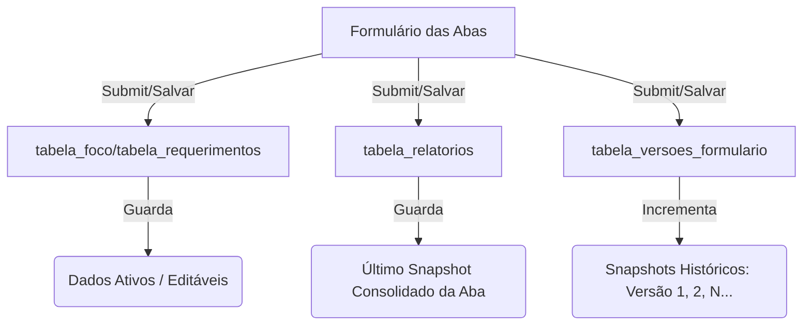

# KB: Versionamento de Dados e Histórico de Trâmites (Ponto de Restauração)

Este documento registra as propostas arquiteturais para o histórico imutável do processo e detalha o funcionamento atual do versionamento no protótipo (agindo como referência para "Ponto de Restauração" caso ocorram falhas ou necessidade de auditoria).

---

## 1. Estado Atual do Versionamento no Protótipo

Atualmente, o sistema possui uma infraestrutura híbrida que combina o estado do draft ativo (editável) com snapshots históricos (leitura).



### Tabelas Envolvidas (Supabase)
1. **`tabela_foco` e `tabela_requerimentos`**: Guardam o rascunho de trabalho ativo (`dados_json`) com base no `numero_requerimento` (PK). Estes dados são sobrescritos a cada alteração e salvamento de campo.
2. **`tabela_relatorios`**: Guarda o último snapshot formatado de cada aba (`process_id`, `aba` como chaves). É atualizado via UPSERT, logo a versão antiga é perdida nesta tabela específica.
3. **`tabela_versoes_formulario`**: Tabela cumulativa sem restrição de conflito. Cada vez que qualquer formulário de aba é salvo, o sistema faz o seguinte fluxo:
   * Consulta a última versão existente da aba para o processo (`order=versao.desc&limit=1`).
   * Define a `proximaVersao = ultimaVersao + 1`.
   * Insere uma nova linha contendo:
     * `processo_id` (UUID ou TEXT do processo)
     * `aba` (ex: `aba1`)
     * `versao` (INT incrementado)
     * `dados_json` (snapshot completo do relatório formatado)
     * `criado_por` (Perfil ativo no momento, ex: `PREFEITURA`, `CARACTERIZACAO`)

---

## 2. Ponto de Restauração (Como recuperar dados se algo der errado)

Como o draft ativo (`tabela_foco`) é sobrescrito a cada salvamento, se o usuário alterar os dados acidentalmente ou se ocorrer uma falha crítica, a **`tabela_versoes_formulario`** atua como o ponto de restauração.

### Procedimento para Restaurar Versão Anterior no Supabase:

1. **Localizar os Snapshots Gravados:**
   Acesse a tabela `tabela_versoes_formulario` no console do Supabase e filtre pelo ID do processo e aba desejada. 
   * Exemplo de query SQL para ver o histórico:
     ```sql
     SELECT versao, criado_em, criado_por, dados_json 
     FROM tabela_versoes_formulario 
     WHERE processo_id = 'PR2026001' AND aba = 'aba1' 
     ORDER BY versao DESC;
     ```

2. **Extrair o JSON do Snapshot:**
   Identifique a versão correta desejada (geralmente `versao - 1` da última gerada) e copie o conteúdo de `dados_json`.

3. **Restaurar no Draft Ativo:**
   Atualize a tabela correspondente do rascunho (ex: `tabela_indicacao` ou `tabela_requerimentos`) com o JSON extraído para que o formulário volte a exibir as informações originais:
   ```sql
   UPDATE tabela_indicacao 
   SET dados_json = '[CONTEUDO_DO_JSON_COPIADO]' 
   WHERE numero_requerimento = 'PR2026001';
   ```

---

## 3. Propostas de Arquitetura para a Versão Final (PHP Laravel + Postgres)

Para a migração futura, o objetivo é consolidar todas as "idas e vindas" (Justificativas de Devolução, Correções e Respostas à Devolutiva) em um **arquivo/relatório único estruturado**.

### Abordagem A: Linha do Tempo de Snapshots (Event-Sourcing) - *RECOMENDADA*
Neste modelo, cada interação humana gera um evento imutável no banco de dados.

```
[Auditoria do Processo Administrativo - Linha do Tempo]

+-----------------------------------------------------------------------------+
| 16/07/2026 10:00 - Envio Inicial da Aba 1 (Prefeitura)                      |
| > RIPs Associados: 2026001                                                  |
+-----------------------------------------------------------------------------+
                                      |
                                      v
+-----------------------------------------------------------------------------+
| 16/07/2026 14:00 - Devolvido por Caracterização (SPU/PR)                    |
| > Justificativa: "O RIP informado foi extinto. Favor informar o RIP 2026002"|
+-----------------------------------------------------------------------------+
                                      |
                                      v
+-----------------------------------------------------------------------------+
| 16/07/2026 15:30 - Correção enviada (Prefeitura)                             |
| > RIPs Associados: 2026002 (Alterado de 2026001)                            |
| > Resposta à Devolutiva: "RIP substituído conforme solicitado."             |
+-----------------------------------------------------------------------------+
```

* **Estrutura de Tabelas Sugerida no Postgres:**
  * `tabela_processos`: Guarda os metadados principais (ID, status atual, data de criação).
  * `tabela_tramites_historico`: Tabela append-only.
    * `id` (PK)
    * `processo_id` (FK)
    * `etapa` (VARCHAR - Aba 1, Aba 2, etc.)
    * `acao` (VARCHAR - Envio, Devolução, Correção, Aprovação)
    * `usuario_id` (FK)
    * `justificativa` (TEXT - armazena o motivo da devolução ou resposta à devolutiva)
    * `dados_snapshot` (JSONB - o estado completo de todos os campos do processo neste momento)
    * `created_at` (TIMESTAMP)

* **Geração do Arquivo Único (PDF/HTML Consolidado):**
  No Laravel, o relatório final é montado renderizando os registros da `tabela_tramites_historico` de forma linear:
  ```php
  $tramites = Tramite::where('processo_id', $id)->orderBy('created_at', 'asc')->get();
  return view('pdf.relatorio_consolidado', compact('tramites'));
  ```

### Abordagem B: Ficha com Histórico Acumulado (JSONB)
Mantém um único registro por processo, mas anexa cada ação a um array JSONB de histórico dentro da própria tabela de processos.
* **Vantagens:** Consulta SQL simples (`SELECT historico_json FROM processos`).
* **Desvantagens:** Risco de ultrapassar limites de tamanho do campo ou lentidão em buscas indexadas complexas no Postgres a longo prazo.
